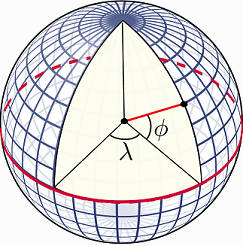

```{r setup, include=FALSE}
knitr::opts_chunk$set(echo = TRUE)
```

***

*Source*: <https://ru-geography.livejournal.com>

***

Everything is related to everything else. But near things are more related than distant things.
Waldo R. Tobler

### 1.1. Пространственные явления и данные

Расстояние - направление - пространственные отношения - географическое положение

Пространственные явления *одновременно* могут рассматриваться: либо как набор дискретных объектов - точек, линий, полигонов, либо как непрерывное поле, внутри которого есть зоны большей и меньшей интенсивности (например, высота, температура, плотность населения и пр.).

Двум типам явлений соответствуют два типа **пространственных данных**:  
* векторные (*spatial objects*)  
* растровые (*continuous phenomena*)  

  
*Source*: <http://sedac.ciesin.columbia.edu/data/collection/gpw-v3/methods/grid>

### 1.2. Система координат и проекция

Естественная *система координат* (Coordinate Reference System или CRS) для географических данных - угловая (в градусах). *Широта* (latitude) - это угол, под которым линия, проведенная через точку на поверхности Земли, пересекает плоскость экватора в центре Земли. *Долгота* (longitude) - это угол между *нулевым меридианом* и меридианом, который проходит через точку на поверхности Земли.

  
*Source*: <http://rspatial.org/spatial/rst/6-crs.html>

Но так как реальная форма Земного шара далека от идеальной сферы, для расчетов используются ее модели - *датумы* - сфероиды с приплюснутыми полюсами и выпуклыми экваторами. 

  
*Source*: <https://imgur.com/gallery/DkSPDph>  

Самая распространенная модель Земли в ГИС - WGS84 (World Geodesic System 1984). С ней работают GPS-навигаторы, google, OSM, yandex и др. Существуют датумы и более сложной формы, созданные для отображения конкретных стран и регионов. В России используют систему координат Pulkovo-1942, которая базируется на элипсоиде Красовского. Таким образом, если вы передаете координаты точки, необходимо уточнять, по отношению к какому датуму они вычислены.

Географические системы координат (ГСК) удобны для создания и для хранения данных, однако если вам необходимо сделать на основе этих данных карту либо провести вычисления (расстояния, площади), то данные необходимо "положить" на плоскость. Эта процедура называется *проецированием*: с помощью математической формулы вы пересчитываете координаты из угловых в метрические. Выбор *проекции* зависит от региона (широты). Самая распространенные проекции - UTM (Universal Transverse Mercator) и ГК (Гаусс-Крюгер). Обе базируются на поперечной проекции Меркатора.  
  
**Равноугольная цилиндрическая проекция Меркатора**
  
*Source*: <https://ru.wikipedia.org/wiki/Проекция_Меркатора> 

С системами координат можно работать в открытой библиотеке PROJ.4.  
PROJ.4 notation - это формат записи данных о CRS, который, в том числе, используется в R.  
Наиболее широко используемые CRS обозначают также EPSG-кодом (*задание: найти расшифровку EPSG*). Например, WGS84 кодируется как `EPSG:4326`, а в PROJ.4 notation выглядит как `+proj=longlat +ellps=WGS84 +datum=WGS84 +no_defs` 


Посмотреть/почитать:  
[Суша. Студия Артемия Лебедева](https://www.artlebedev.ru/susha/)  
[GIS-Lab: Часто задаваемые вопросы по координатам, проекциям, системам координат](http://gis-lab.info/qa/proj-sk-faq.html)  
[R Spatial: Coordinate Reference Systems](http://rspatial.org/spatial/rst/6-crs.html)  
[Spatial Reference](http://spatialreference.org)