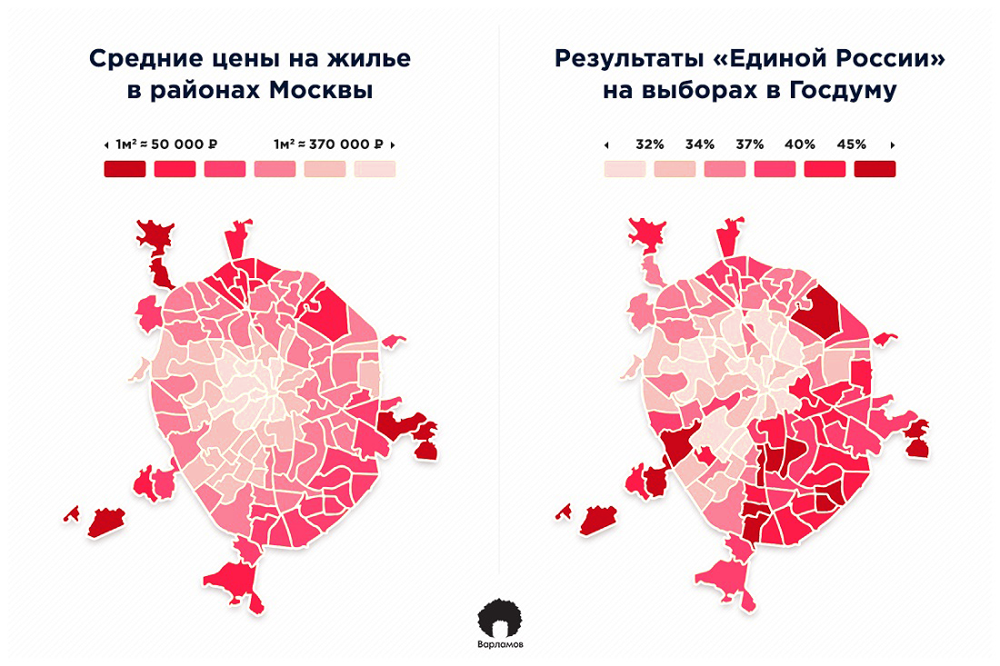

```{r setup, include=FALSE}
knitr::opts_chunk$set(echo = TRUE)
```

***
Главные packages для работы с пространственными данными в R: `sp` и `raster`. Они определяют классы объектов, с которыми работают все остальные пакеты.

```{r first packages, echo=TRUE, message=FALSE, warning=FALSE}
library(sp)
library(raster)
```

***

#### 2.1. Классы векторных данных

Виды векторных данных:  
**Точки** (*points*) - простейший вид. Каждая точка имеет одну координатную пару (x, y).  
**Линия** (*line*) - набор точек (узлов), соединенный в определенном порядке.  
**Полигон** (*polygon*) - замкнутая линия: первая координатная пара является и последней.  
В пакете sp им соответствуют различные объекты класса Spatial.  

*Что значит: объект относится к классу?*  
Spatial* object можно представить в виде списка, слоты которого хранят свойства объекта (параметры, методы)  

Давайте создадим объект класса `SpatialPoints` из 10 случайных точек. Для этого достаточно дать на вход соответствующей функции из пакета `sp` матрицу с координатами
```{r spatial points, echo=TRUE}
set.seed(12)
# Широта
latitude <- sample(-90:90, 10, replace = T)
# Долгота
longitude <- sample(-180:180, 10, replace = T)
lonlat <- cbind(longitude, latitude)
pts <- SpatialPoints(coords = lonlat)
# Посмотрим на структуру объекта
str(pts)
```

Ничего не забыли? Осталось указать систему координат  
```{r CRS, echo=TRUE}
# Set the coordinate reference system
WGS84 <- CRS('+proj=longlat +ellps=WGS84 +datum=WGS84 +no_defs')
pts <- SpatialPoints(coords = lonlat, proj4string = WGS84)
pts
```

Чтобы создать `SpatialLines` и `SpatialPolygons` воспользуемся функциями `spLines()` and `spPolygons()` из пакета `raster`  
```{r spatial lines, echo=TRUE}
lns <- spLines(lonlat, crs=WGS84)               # линии
pols <- spPolygons(lonlat, crs=WGS84)           # полигоны
lns
pols
```

Посмотрим, как это выглядит на карте  
```{r simple map , echo=TRUE}
plot(pols, col = "#e5f5f9", axes = T)           # plot polygon
plot(lns, col = "#99d8c9", add = T)             # add lines
plot(pts, col = "#2ca25f", pch = 20, add = T)   # add points
```

***

#### 2.2. Атрибутивные данные

**Spatial object** = **geometry** + **attributes**

Данные, привязанные к пространственным объектам, называются *атрибутами*. Features (отдельные точки, линии, полигоны) - это наши наблюдения, в таблице атрибутов им соответствуют строки. Столбцы - это переменные.

Давайте добавим нашим точкам атрибуты
```{r add data, echo=TRUE}
# Создадим data.frame с данными
df <- data.frame(ID=1:nrow(lonlat), var=longitude^2/max(longitude)*10)
# Получилась вот такая табличечка
df
# Соединяем геометрию и атрибуты
ptsdf <- SpatialPointsDataFrame(pts, df)

# Визуализируем
plot(pols, col = "#e5f5f9", axes = T)           # plot polygon
plot(lns, col = "#99d8c9", add = T)             # add lines
plot(ptsdf, col = "#2ca25f", pch = 20, 
     cex = log(ptsdf$var),                   # устанавливаем размер точек
     add = T)
```

***

#### 2.3. Чтение геоданных

Третий must-have пакет для работы с пространственными данными в R: `rgdal`. Это обертка для GDAL/OGR (Geospatial Data Abstraction Library) - открытой библиотеки, написанной на C и используемой во всех ключевых ГИС-программах (ArcGIS, QGIS, SAGA GIS и др.).

```{r rgdal, echo=TRUE, message=FALSE, warning=FALSE}
library(rgdal)
```

Самые распространенные форматы геоданных - **ESRI Shapefile** и **GeoJSON**.

Загрузим данные об административно-территориальных границах из проекта [Natural Earth](https://www.naturalearthdata.com/downloads/10m-cultural-vectors/) из файла в формате shapefile. Для этого используем функцию `readOGR()` из пакета `rgdal`.

```{r read countries, echo=TRUE, message=FALSE, warning=FALSE}
countries <- readOGR(dsn = "data/world/world.shp", stringsAsFactors = F)
countries
plot(countries)
```

В случае с shapefiles мы также можем использовать обертку для `rgdal` из пакета `raster`  
```{r read countries2, echo=TRUE, message=FALSE, warning=FALSE}
# Alternatively
# countries <- shapefile("data/world/world.shp", stringsAsFactors = F)
```

***

#### 2.4. Картограммы

Какие данные хранит `countries`?  
```{r countries data, echo=TRUE, message=FALSE, warning=FALSE}
head(countries@data)
```
*POP_THS: численность наслеения, тыс. чел.*  
*GDP_MD_EST: ВВП, млн $*  

**На этом занятии наша задача - построить картограмму плотности населения по странам**

Для работы с атрибутивными данными и визуализации понадобится еще несколько пакетов  
```{r more packages, echo=TRUE, message=FALSE, warning=FALSE}
library(dplyr)
library(ggplot2)
library(classInt)
library(RColorBrewer)
library(cartography)
```

##### 2.4.1 Изменение атрибутивных данных

Рассчитаем площадь стран с помощью функции `area()` из пакета `raster`  
```{r area, echo=TRUE, message=FALSE, warning=FALSE}
countries@data$AREA <- area(countries)/1000000  # км2
# Плотность населения по странам
countries@data %>% 
  mutate(POP_DENS = round(x = POP_THS*1000/AREA, digits = 2)) -> 
  countries@data
```

Отлично! Однако прежде чем строить саму карту, надо понять, на какие интервалы мы разобьем наблюдения, и выбрать цветовую палитру  

##### 2.4.2 Как разделить числовой вектор на интервалы 

Посмотрим на распределение данных  
```{r distr, echo=TRUE, message=FALSE, warning=FALSE}
countries@data %>% 
  ggplot(aes(POP_DENS))+
  geom_histogram(binwidth = 200)
```

Есть выбросы, поэтому равные интервалы не подходят.    

Функция classIntervals() из пакета classInt принимает на вход числовой вектор и возвращает границы интервалов в зависимости от выбранного метода: "fixed", "sd", "equal", "pretty", "quantile", "kmeans", "hclust", "bclust", "fisher" или "jenks"  
```{r intervals, echo=TRUE, message=FALSE, warning=FALSE}
# Я выбрал квантили
pop_den_ints <- classIntervals(var = countries@data$POP_DENS, n = 7, style = "quantile")
pop_den_ints
```

##### 2.4.3 Цветовые палитры 

В R есть встроенный набор цветовых схем, однако у картографов есть свои любимчики. Во-первых, это библиотека [ColorBrewer](http://colorbrewer2.org/) и созданный на ее основе пакет `RColorBrewer`. Во-вторых, `viridis` - стандартный набор цветовых схем для карт в библиотеке matplotlib.

##### 2.4.4 Строим картограмму (choropleth map) с помощью Cartography

Plot в `cartography` создается послойно. Сначала рисуем layout, затем основной слой, а сверху добавляем легенду. Для разных типов карт (Label Map, Сhoropleth Ьap, Proportional Symbols, Gridded Map и др.) в пакете есть отдельные функции. В случае с картограммами это `choroLayer()`  

```{r cartogram, echo=TRUE, message=FALSE, warning=FALSE}
# Обрежем поля
par(mar = c(1,0,1,0))
# Layout layer
layoutLayer(title = "Population Density (quantiles)", author = "Al.Shel. for AnDan",
            sources = "Natural Earth, 2018", col = NA, frame = FALSE,
            bg = "#A6CAE0",
            scale = NULL, coltitle = "black", extent = countries)
# Основной слой
choroLayer(spdf = countries,                       # объект SpatialPolygonsDataFrame
           var = "POP_DENS",                       # картографируемая переменная (столбец) 
           border = "grey1", lwd = 0.5,            # цвет и толщина границ полигонов
           breaks = pop_den_ints$brks,             # границы интервалов
           col = rev(brewer.pal(7, "Spectral")),   # color palette 
           legend.pos = "n",                       # none - легенду отрисуем позже
           add = T)
# Легенда
legendChoro(pos = "left", title.txt = "per/sq km", 
            values.cex = 0.7, breaks = pop_den_ints$brks, values.rnd = 0,
            col = rev(brewer.pal(7, "Spectral")), frame = T, symbol = "box", nodata = T)
```

*Посмотреть/почитать:*  
[cartography Vignettes](https://cran.r-project.org/web/packages/cartography/vignettes/cartography.html#base-map-and-proportional-symbols)  

***

#### 2.4.5. Самостоятельная работа 1

**Задание:** Рассчитайте для стран ВВП на душу населения, разбейте на собственное усмотрение полученные наблюдения на группы (страны с высоким GDP per capita, средним и пр.) и отобразите эти группы на карте.

***

#### 2.5. Самостоятельная работа 2

**Задание:** с 2012 года CRAN ежедневно публикует [анонимизированные данные](http://cran-logs.rstudio.com) о скачивании пакетов для R. Возьмите любой день/дни (вчера? ваш день рождения? и т.д.) и проанализируйте, какие пакеты чаще всего качают пользователи и из каких они стран. *Создайте карту, которая показывает территориальное распределение пользователей*. Описание структуры данных вы найдете на странице cran-logs.  

*Подсказка*: чтобы найти координаты центроида полигона, используйте `coordinates()` из пакета `sp`  

***

#### 2.6. Быстрый leaflet


<!-- Cartogram - cartodiagrame -->

<!-- *** -->

<!-- **Average prices for housing** vs **"Edinaya Rossiya" election results** in *Moscow* -->

<!--  -->
<!-- *Source*: <https://varlamov.ru/2427106.html> -->

<!-- *** -->

<!--  -->
<!-- Source: <https://www.economist.com/news/britain/21644155-britain-bangladeshis-have-overtaken-pakistanis-credit-poor-job-market-when-they-arrived>   -->

<!-- **Building Age Maps**   -->
<!-- Chicago: <http://buildings.transitized.com>   -->
<!-- Amsterdam: <https://code.waag.org/buildings/#52.3663,4.8883,14> -->

<!-- *** -->


<!-- #### 1.1.1 Raster data -->

<!-- Растр делит территорию на сетку (grid), состояющую из одинаковых прямоугольников - *ячеек* (cells) или пикселей. Размер ячейки - это *разрешение* (resolution) растра. Ячейки кодируют значение переменной (интенсивность явления). Значение ячейки (cell value) - это среднее либо сумма значений территории, которую она покрывает.  -->

<!-- **ASTER GDEM 2011** elevation data -->

<!-- ```{r elevation 1, echo=TRUE} -->

<!-- library(sp) -->
<!-- library(raster) -->
<!-- library(RColorBrewer) -->
<!-- library(lattice) -->
<!-- library(latticeExtra) -->
<!-- library(rasterVis) -->

<!-- # Read raster data -->
<!-- elev <- raster("data/ASTGTM2_N56E037_dem.tif") -->
<!-- elev -->
<!-- ``` -->

<!-- The natural *coordinate reference system* for geographic data is *longitude/latitude*. In this case x.y show the location of the given point on “spheroid”. However, if we want to make map, we have to transform this three dimensional system to a two dimensional planar system. This transformation is called *projection*. So, by projection you flatten your original spheroid into the plain surface with some mathematical calculations. -->

<!-- ```{r elevation 2, echo=TRUE} -->
<!-- # Plot -->
<!-- levelplot(elev, margin=FALSE, colorkey=list(space='bottom', -->
<!--                                             labels=list(at=seq(0,350, 50), font=4), -->
<!--                                             axis.line=list(col='black'), -->
<!--                                             width=0.75), -->
<!--           par.settings=list(strip.border=list(col='transparent'), -->
<!--                             strip.background=list(col='transparent'), -->
<!--                             axis.line=list(col='transparent')), -->
<!--           xlab = NULL, -->
<!--           ylab = NULL, -->
<!--           scales=list(draw=FALSE), -->
<!--           col.regions=colorRampPalette(rev(brewer.pal(8, 'RdYlGn'))[1:7]), -->
<!--           alpha.regions = 0.7, -->
<!--           at=seq(0,350, 50), -->
<!--           names.attr="bbb") -->

<!-- ``` -->

<!-- Let's take a look at the same area on OpenStreetMap. -->

<!-- ```{r leaflet, echo=TRUE, out.width="100%"} -->
<!-- library(leaflet) -->
<!-- # Load leaflet map -->
<!-- leaflet() %>% setView(lng = 56.33, lat = 58.3, zoom = 9) %>% addTiles() -->

<!-- ``` -->
<!-- <style></style> -->

<!-- **Other examples**: -->
<!-- Population Density: <http://luminocity3d.org/WorldPopDen/> -->
<!-- "A Nation divided" by Die Zeit:   <http://www.zeit.de/feature/german-unification-a-nation-divided> -->


<!-- **Data sources**:     -->
<!-- * Open data of the Ministry of Culture of the Russian Federation <https://opendata.mkrf.ru/opendata/>   -->
<!-- * Open reports of housing and comminal servicies companies <https://www.reformagkh.ru/myhouse?tid=2299765&sort=name&order=asc&page=1&limit=100>    -->
<!-- * OpenStreetMap <https://www.openstreetmap.org> -->

<!-- ### More to know about spatial analysis in R: -->

<!-- <http://rspatial.org/index.html> -->


