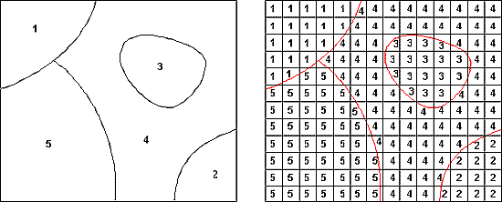

```{r setup, include=FALSE}
knitr::opts_chunk$set(echo = TRUE)
```

***

> You can never understand everything. But you should push yourself to understand the system.  
> Ryan Dahl  

***

### 3.1. Что такое растровое изображение?

Что показывают эти [снимки](https://www.google.com/search?q=%D1%81%D0%BD%D0%B8%D0%BC%D0%BA%D0%B8+%D1%85%D0%B0%D0%B1%D0%B1%D0%BB&client=safari&rls=en&source=lnms&tbm=isch&sa=X&ved=0ahUKEwjf6sywlLfcAhUlM5oKHUU-Ag4Q_AUICigB&biw=1440&bih=839)?  

Мы видим лишь небольшую часть спектра электромагнитного излучения  

*Source*: https://ru.wikipedia.org/wiki/Электромагнитное_излучение#/media/File:EM_spectrum.svg  

На самом деле, совершенно не обязательно при построении растровых изображений ограничиваться только видимой частью излучения Мы можем комбинировать каналы. Этот прием чаще всего исопьзуется при анализе и дешифрировании космоснимков  

[Примеры](https://www.harrisgeospatial.com/Learn/Blogs/Blog-Details/TabId/2716/ArtMID/10198/ArticleID/15691/The-Many-Band-Combinations-of-Landsat-8.aspx)

[Landsat band combinations interactive tool](http://www.geocarto.com.hk/edu/PJ-BCMBLSAT/main_BCLS.html)

Растровые изображения можно представить как числовые матрицы, которые хранят в ячейках значения переменных  

  

Категориальные данные: пример - [Glabal Land Cover](http://www.globeland30.com/GLC30Download/index.aspx)  

Как и с другими матрицами, с растровыми изображениями можно проводить математические операции: складывать, вычитать, умножать, возводить в степень и т.п. (raster algebra)  

***

### 3.2. Классы растровых изображений в R

`raster` позволяет создавать объекты трех классов: `RasterLayer`, `RasterStack` и `RasterBrick`

`RasterLayer` состоит из 1 слоя (1 переменная)  
```{r raster layer, echo=TRUE, message=FALSE, warning=FALSE}
library(raster)
r <- raster(ncol=10, nrow=10, xmx=-80, xmn=-150, ymn=20, ymx=60)
r
```

В данном примере мы создали RasterLayer, состоящий из 100 ячеек (10*10). 
Обратите внимание на систему координат объекта.
В каких единицах указано разрешение растра (размеры одной ячейки)?

```{r raster values, echo=TRUE, message=FALSE, warning=FALSE}
values(r) # Сейчас ячейки пустые
# Наполним их значениями
values(r) <- 1:ncell(r)
plot(r)
```

`RasterStack` и `RasterBrick` это классы растровых объектов с множеством слоев. Разница в том, как они хранят данные: `RasterStack` - это список (list) из нескольких файлов или слоев ("bands") одного файла, имеющих одинаковый экстент и разрешение. `RasterBrick` - это всегда один многослойный объект, поэтому расчеты с ним могут быть быстрее.  


```{r stack and brick, echo=TRUE, message=FALSE, warning=FALSE}
# RasterStack
s <- stack(r, r*r)
s
# RasterBrick
b <- brick(s)
b
plot(b)
```

### 3.3. Чтение растровых данных

Для примера посмотрим на данные о высотах из проекта *ASTER GDEM 2011*  

```{r elevation 1, echo=TRUE}

# Read raster data
elev <- raster("data/ASTGTM2_N55E037_dem.tif")
elev
```

Что это за территория? Попробуем взглянуть на картинку    
```{r elevation 2, echo=TRUE}
plot(elev)
```
*Source*: USGS.  

***

#### 3.3.1. Задание 4

Откройте ту же территорию в leaflet (используйет данные из свойств `RasterLayer`)  

***

### 3.4. Визуализация растровых изображений с помощью `rasterVis`

Построим простую карту высот  

#### 3.4.1 Подготовка данных

Для начала удалим все лишнее, обрезав растр в границах города  

```{r moscow borders, echo=TRUE, message=FALSE, warning=FALSE}
# Чтение данных о границах
moscow <- shapefile("data/mos_ao/ao.shp")
plot(moscow)
moscow@data
```

```{r crop elevation, echo=TRUE, message=FALSE, warning=FALSE}
library(dplyr)
# Чтение данных о границах
elev %>% 
  crop(moscow) %>%                      # returns raster clipped by Spatial* object’s extent
  mask(moscow) -> elev_cropped          # returns raster, clipped by Spatial* object’s contour
elev_cropped
plot(elev_cropped)
```

#### 3.4.2 Интервалы

Какой перевад высот мы получили? Взглянем на гистограмму  
```{r elev val distr, echo=TRUE, message=FALSE, warning=FALSE}
library(ggplot2)
ggplot()+
  geom_histogram(aes(values(elev_cropped)))
summary(values(elev_cropped))
```

Есть небольшое число выбросов, проигнорируем их   

#### 3.4.3 Levelplot

```{r elevation plot, echo=TRUE, message=FALSE, warning=FALSE}
library(rasterVis)
levelplot(elev_cropped, 
          at=seq(75, 300, 25),
          col.regions=colorRampPalette(rev(brewer.pal(10, 'RdYlGn'))),
          margin=FALSE, colorkey=list(space='bottom',
                                      labels=list(at=seq(75, 300, 25), font=4),
                                      axis.line=list(col='black'),
                                      width=0.75),
          par.settings=list(strip.border=list(col='transparent'),
                            strip.background=list(col='transparent'),
                            axis.line=list(col='transparent')),
          xlab = NULL,
          ylab = NULL,
          scales=list(draw=FALSE),
          alpha.regions = 1)
```

### 3.5. А что если?

#### 3.5.1 А что если я хочу вытащить статистику из растра по отдельным полигонам? 

...и не обрезать растр каждый раз  
`extract()` из пакета `raster`  

```{r extract values, echo=TRUE, message=FALSE, warning=FALSE}
extract(elev_cropped,   # RasterLayer
        moscow,         # SpatialPolygon
        fun = mean,     # функция
        # sp = T,       # сохрани результат расчета в таблицу атрибутов Spatial* объекта
        df = T)         # верни табличку 
```

а что если растр такой тяжелый, а у меня не видеокарта для майнинга?  

Тогда используй пакет velox. Он использует другие алгоритмы вычислений. Минус в том, что velox работает только с объектами собственных классов  

```{r extract values velox, echo=TRUE, message=FALSE, warning=FALSE}
library(velox)
# создаем объект velox из нашего растра
my_velox <- velox(elev_cropped)
# доступные функции хранятся в свойствах самого объекта.
# Вызываем их через $
my_velox$extract(sp = moscow, 
                 fun = mean, 
                 df = T)
```

*Посмотреть/почитать:* ссылка на мой гит

#### 3.5.2 А что если я хочу добавить в levelplot векторные объекты?


```{r levelplot_vectors, echo=TRUE, message=FALSE, warning=FALSE}
levelplot(elev_cropped, 
          at=seq(75, 300, 25),
          col.regions=colorRampPalette(rev(brewer.pal(10, 'RdYlGn'))),
          margin=FALSE, colorkey=list(space='bottom',
                                      labels=list(at=seq(75, 300, 25), font=4),
                                      axis.line=list(col='black'),
                                      width=0.75),
          par.settings=list(strip.border=list(col='transparent'),
                            strip.background=list(col='transparent'),
                            axis.line=list(col='transparent')),
          xlab = NULL,
          ylab = NULL,
          scales=list(draw=FALSE),
          alpha.regions = 1)+
  layer(sp.lines(moscow, col = "grey32", lwd = 1.5))
```

#### 3.5.3 А что если я хочу хочу сохранить мой растр?

```{r write raster, eval=FALSE, message=FALSE, warning=FALSE, include=FALSE}
writeRaster(elev_cropped, filename = "data/Moscow_elevation.tif")
```